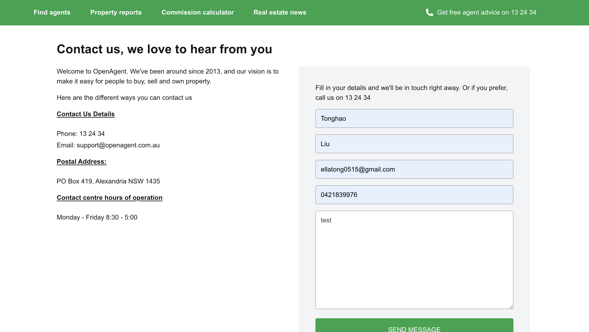

## OpenAgent Junior Software Engineer Tech Test

This client app is built with **React**, **Next.js**, and api is built with **Express.js**, using **SQLite** for data storage.
Providing **docker-compose** file for running the app.

### Table of Contents

- [OpenAgent Junior Software Engineer Tech Test](#openagent-junior-software-engineer-tech-test)
  - [Table of Contents](#table-of-contents)
  - [Technologies Used](#technologies-used)
  - [Installation](#installation)
  - [Running Localhost](#running-localhost)
  - [Running with Docker](#running-with-docker)
  - [Running Tests](#running-tests)
  - [Project URL](#project-url)
  - [Project Requirement](#project-requirement)
  - [Demo Link](#demo-link)
  - [Potential improvements](#potential-improvements)

### Technologies Used

- **Frontend**: Next.js (React), Tailwind CSS.
- **Backend**: node 18, Express.js.
- **Database**: SQLite.
- **Testing**: Jest.
- **Containerization**: Docker, Docker Compose.
- Using npm workspaces to manage the monorepo.

### Installation

- Clone the repository:

```bash
git clone https://github.com/EllaLiu0401/ContactUs.git
cd ContactUs
```

- Install the frond-end dependencies:

```bash
npm install
```

- Install the back-end dependencies:

```bash
cd packages/api
npm install
```

- Create the SQLite database:

```bash
node database/createDb.js
```

### Running Localhost

- Change `ContactUs/packages/api/.env.dev` to `ContactUs/packages/api/.env`
- Change `ContactUs/packages/ui/.env.dev` to `ContactUs/packages/ui/.env`

- Go to `ContactUs` folder:

```bash
npm run dev
```

### Running with Docker

- Go to `ContactUs` folder:

- Build the Docker image:

```bash
docker-compose build
```

- Start the containers:

```bash
docker-compose up
```

### Running Tests

Go to each folder (`ContactUs/packages/api`, `ContactUs/packages/ui`) and run the following command to run the tests:

```bash
npm run test
```

### Project URL

Backend: http://localhost:9000
Frontend: http://localhost:3000
Frontend-Contact: http://localhost:3000/contact
Frontend-Content-List: http://localhost:3000/contactList

### Project Requirement

- Contact Us:
  
- Contact Us Thank you:
  
- Email and phone validation:
  
- Empty validation:
  
- Contact List:
  

### Demo Link

https://drive.google.com/file/d/1UaOXxSCnSb6z-GnbF81wwAtyRWaxsneS/view?usp=drive_link

### Potential improvements

- API could be built using webpack to reduce image size
- Better to use TypeScript for backend Restful API
- Could use swagger-jsdoc for API documentation
- UI side could use pagination for loading all contacts
- PostgreSQL might be easier than SQLite since I've never used SQLite before, but I'm challenging myself with it in this project.
